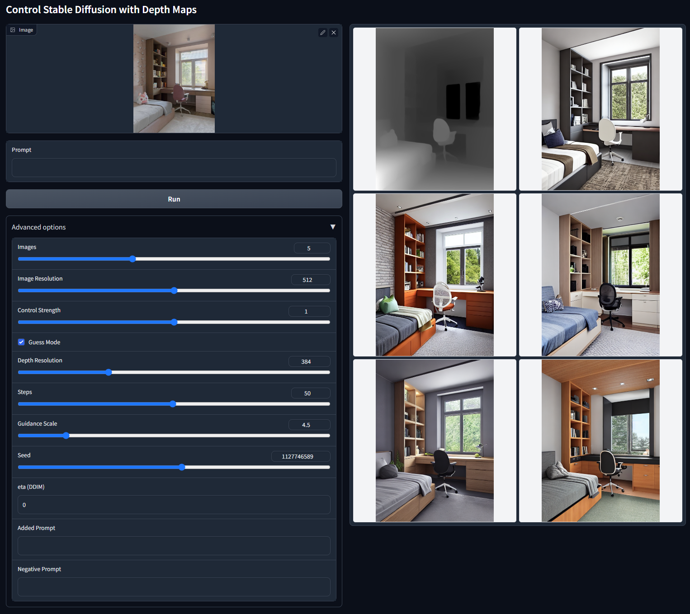
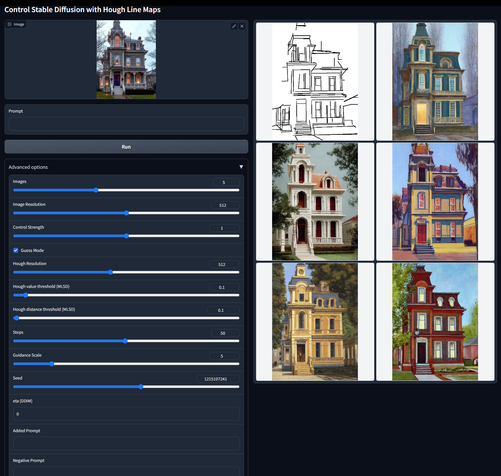
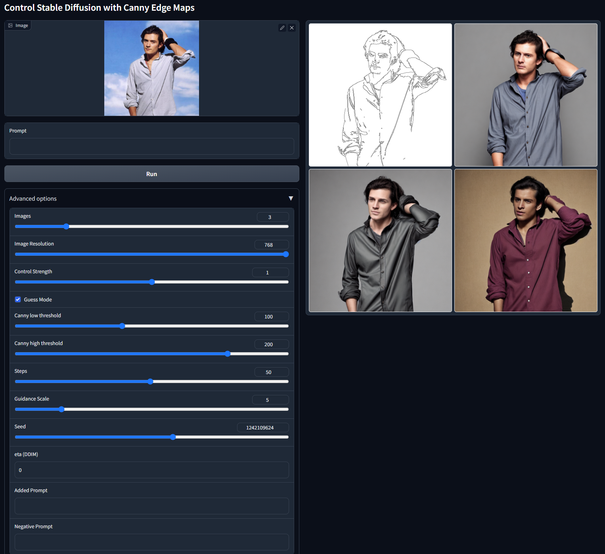
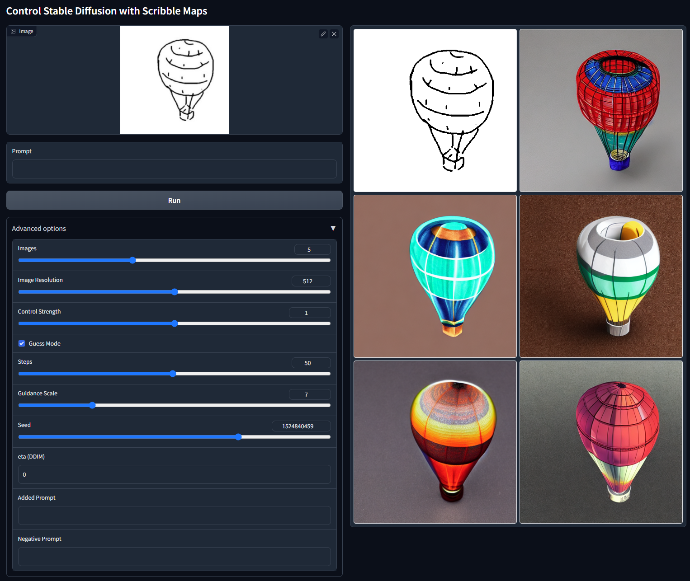
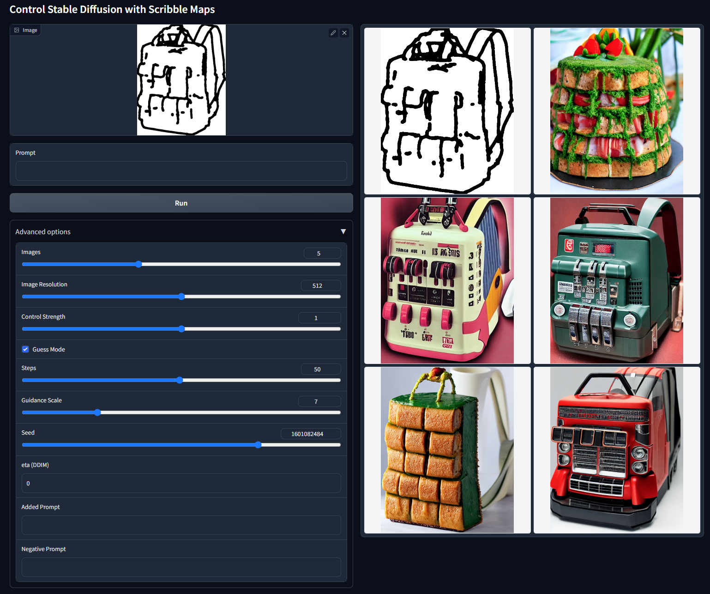
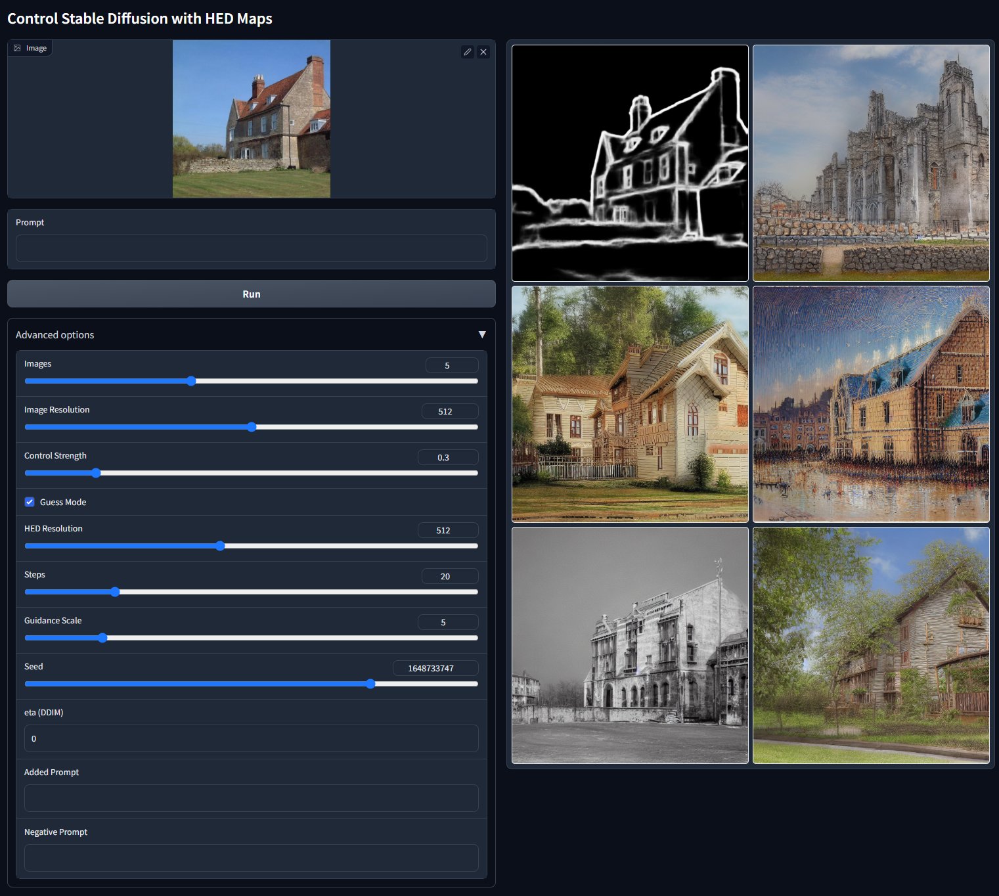

# ControlNet

Official implementation of [Adding Conditional Control to Text-to-Image Diffusion Models](https://arxiv.org/abs/2302.05543).

ControlNet is a neural network structure to control diffusion models by adding extra conditions.

It copys the weights of neural network blocks into a "locked" copy and a "trainable" copy. 

The "trainable" one learns your condition. The "locked" one preserves your model. 

Thanks to this, training with small dataset of image pairs will not destroy the production-ready diffusion models.

The "zero convolution" is 1×1 convolution with both weight and bias initialized as zeros. 

Before training, all zero convolutions output zeros, and ControlNet will not cause any distortion.

No layer is trained from scratch. You are still fine-tuning. Your original model is safe. 

This allows training on small-scale or even personal devices.

This is also friendly to merge/replacement/offsetting of models/weights/blocks/layers.

### FAQ

**Q:** But wait, if the weight of a conv layer is zero, the gradient will also be zero, and the network will not learn anything. Why "zero convolution" works?

**A:** This is not true. [See an explanation here](docs/faq.md).

# Stable Diffusion + ControlNet

By repeating the above simple structure 14 times, we can control stable diffusion in this way:

Note that the way we connect layers is computational efficient. The original SD encoder does not need to store gradients (the locked original SD Encoder Block 1234 and Middle). The required GPU memory is not much larger than original SD, although many layers are added. Great!

# Production-Ready Pretrained Models

First create a new conda environment

    conda env create -f environment.yaml
    conda activate control

All models and detectors can be downloaded from [our Hugging Face page](https://huggingface.co/lllyasviel/ControlNet). Make sure that SD models are put in "ControlNet/models" and detectors are put in "ControlNet/annotator/ckpts". Make sure that you download all necessary pretrained weights and detector models from that Hugging Face page, including HED edge detection model, Midas depth estimation model, Openpose, and so on. 

We provide 9 Gradio apps with these models.

All test images can be found at the folder "test_imgs".

### News

2023/02/20 - Implementation for non-prompt mode released. See also [Guess Mode / Non-Prompt Mode](#guess-anchor).

2023/02/12 - Now you can play with any community model by [Transferring the ControlNet](https://github.com/lllyasviel/ControlNet/discussions/12).

2023/02/11 - [Low VRAM mode](docs/low_vram.md) is added. Please use this mode if you are using 8GB GPU(s) or if you want larger batch size.

## ControlNet with Canny Edge

Stable Diffusion 1.5 + ControlNet (using simple Canny edge detection)

    python gradio_canny2image.py

The Gradio app also allows you to change the Canny edge thresholds. Just try it for more details.

Prompt: "bird"

Prompt: "cute dog"

## ControlNet with M-LSD Lines

Stable Diffusion 1.5 + ControlNet (using simple M-LSD straight line detection)

    python gradio_hough2image.py

The Gradio app also allows you to change the M-LSD thresholds. Just try it for more details.

Prompt: "room"

Prompt: "building"

## ControlNet with HED Boundary

Stable Diffusion 1.5 + ControlNet (using soft HED Boundary)

    python gradio_hed2image.py

The soft HED Boundary will preserve many details in input images, making this app suitable for recoloring and stylizing. Just try it for more details.

Prompt: "oil painting of handsome old man, masterpiece"

Prompt: "Cyberpunk robot"

## ControlNet with User Scribbles

Stable Diffusion 1.5 + ControlNet (using Scribbles)

    python gradio_scribble2image.py

Note that the UI is based on Gradio, and Gradio is somewhat difficult to customize. Right now you need to draw scribbles outside the UI (using your favorite drawing software, for example, MS Paint) and then import the scribble image to Gradio. 

Prompt: "turtle"

Prompt: "hot air balloon"

### Interactive Interface

We actually provide an interactive interface

    python gradio_scribble2image_interactive.py

However, because gradio is very [buggy](https://github.com/gradio-app/gradio/issues/3166) and difficult to customize, right now, user need to first set canvas width and heights and then click "Open drawing canvas" to get a drawing area. Please do not upload image to that drawing canvas. Also, the drawing area is very small; it should be bigger. But I failed to find out how to make it larger. Again, gradio is really buggy.

The below dog sketch is drawn by me. Perhaps we should draw a better dog for showcase.

Prompt: "dog in a room"

## ControlNet with Fake Scribbles

Stable Diffusion 1.5 + ControlNet (using fake scribbles)

    python gradio_fake_scribble2image.py

Sometimes we are lazy, and we do not want to draw scribbles. This script use the exactly same scribble-based model but use a simple algorithm to synthesize scribbles from input images.

Prompt: "bag"

Prompt: "shose" (Note that "shose" is a typo; it should be "shoes". But it still seems to work.)

## ControlNet with Human Pose

Stable Diffusion 1.5 + ControlNet (using human pose)

    python gradio_pose2image.py

Apparently, this model deserves a better UI to directly manipulate pose skeleton. However, again, Gradio is somewhat difficult to customize. Right now you need to input an image and then the Openpose will detect the pose for you.

Prompt: "Chief in the kitchen"

Prompt: "An astronaut on the moon"

## ControlNet with Semantic Segmentation

Stable Diffusion 1.5 + ControlNet (using semantic segmentation)

    python gradio_seg2image.py

This model use ADE20K's segmentation protocol. Again, this model deserves a better UI to directly draw the segmentations. However, again, Gradio is somewhat difficult to customize. Right now you need to input an image and then a model called Uniformer will detect the segmentations for you. Just try it for more details.

Prompt: "House"

Prompt: "River"

## ControlNet with Depth

Stable Diffusion 1.5 + ControlNet (using depth map)

    python gradio_depth2image.py

Great! Now SD 1.5 also have a depth control. FINALLY. So many possibilities (considering SD1.5 has much more community models than SD2).

Note that different from Stability's model, the ControlNet receive the full 512×512 depth map, rather than 64×64 depth. Note that Stability's SD2 depth model use 64*64 depth maps. This means that the ControlNet will preserve more details in the depth map.

This is always a strength because if users do not want to preserve more details, they can simply use another SD to post-process an i2i. But if they want to preserve more details, ControlNet becomes their only choice. Again, SD2 uses 64×64 depth, we use 512×512.

Prompt: "Stormtrooper's lecture"

## ControlNet with Normal Map

Stable Diffusion 1.5 + ControlNet (using normal map)

    python gradio_normal2image.py

This model use normal map. Rightnow in the APP, the normal is computed from the midas depth map and a user threshold (to determine how many area is background with identity normal face to viewer, tune the "Normal background threshold" in the gradio app to get a feeling).

Prompt: "Cute toy"

Prompt: "Plaster statue of Abraham Lincoln"

Compared to depth model, this model seems to be a bit better at preserving the geometry. This is intuitive: minor details are not salient in depth maps, but are salient in normal maps. Below is the depth result with same inputs. You can see that the hairstyle of the man in the input image is modified by depth model, but preserved by the normal model. 

Prompt: "Plaster statue of Abraham Lincoln"

## ControlNet with Anime Line Drawing

We also trained a relatively simple ControlNet for anime line drawings. This tool may be useful for artistic creations. (Although the image details in the results is a bit modified, since it still diffuse latent images.)

This model is not available right now. We need to evaluate the potential risks before releasing this model. Nevertheless, you may be interested in [transferring the ControlNet to any community model](https://github.com/lllyasviel/ControlNet/discussions/12).

# Guess Mode / Non-Prompt Mode

The "guess mode" (or called non-prompt mode) will completely unleash all the power of the very powerful ControlNet encoder. 

You need to manually check the "Guess Mode" toggle to enable this mode.

In this mode, you can just remove all prompts, and then the ControlNet encoder will recognize the content of the input control map, like depth map, edge map, scribbles, etc.

**No prompts. No "positive" prompts. No "negative" prompts. One single diffusion loop. No extra caption detector.**

**Let's play some really harder game!**

This task is the most difficult one among all tasks in this work.

This mode is very suitable for comparing different methods to control stable diffusion, because the non-prompted generating task is significantly more difficult than prompted task. In this mode, the performance difference between different methods will be **very salient**.

Feel free to reproduce the below examples using the parameters in the screenshots.

For this mode, we recommend to use 50 steps and guidance scale between 3 and 5.

Besides, if you write a script to generate image captions from the "guess mode" images, and then use the generated captions as prompts to diffuse again, you will get a SOTA pipeline for fully automatic conditional image generating.

Note that the below example is 768×768.

By tuning the parameters, you can get some very intereting results like below:

Because no prompt is available, the ControlNet encoder will "guess" what is in the control map. Sometimes the guess result is really interesting. Because diffusion algorithm can essentially give multiple results, the ControlNet seems able to give multiple guesses, like this:

Without prompt, the HED seems good at generating images look like paintings when the control strength is relatively low:

As you can see below, because **non-prompted mode is extremely difficult**, even the very deep ControlNet may also generate failure cases. (In the example below, the right-bottom one seems ok while others look meh.) Because of this, the non-prompted mode seems a nice metric to test the capability of different encoder-based methods to control stable diffusion.

# Annotate Your Own Data

We provide simple python scripts to process images.

[See a gradio example here](docs/annotator.md).

# Train with Your Own Data

Training a ControlNet is as easy as (or even easier than) training a simple pix2pix. 

[See the steps here](docs/train.md).

# Related Resources

Special Thank to the great project - [Mikubill' A1111 Webui Plugin](https://github.com/Mikubill/sd-webui-controlnet) !

We also thank Hysts for making [Hugging Face Space](https://huggingface.co/spaces/hysts/ControlNet) as well as more than 65 models in that amazing [Colab list](https://github.com/camenduru/controlnet-colab)! 

We also thank all authors for making Controlnet DEMOs, including but not limited to [fffiloni](https://huggingface.co/spaces/fffiloni/ControlNet-Video), [other-model](https://huggingface.co/spaces/hysts/ControlNet-with-other-models), [ThereforeGames](https://github.com/AUTOMATIC1111/stable-diffusion-webui/discussions/7784), [RamAnanth1](https://huggingface.co/spaces/RamAnanth1/ControlNet), etc!

Besides, you may also want to read these amazing related works:

[T2I-Adapter: Learning Adapters to Dig out More Controllable Ability for Text-to-Image Diffusion Models](https://github.com/TencentARC/T2I-Adapter): A much smaller model to control stable diffusion!

[ControlLoRA: A Light Neural Network To Control Stable Diffusion Spatial Information](https://github.com/HighCWu/ControlLoRA): Implement Controlnet using LORA!

And these amazing recent projects: [InstructPix2Pix Learning to Follow Image Editing Instructions](https://www.timothybrooks.com/instruct-pix2pix), [Pix2pix-zero: Zero-shot Image-to-Image Translation](https://github.com/pix2pixzero/pix2pix-zero), [Plug-and-Play Diffusion Features for Text-Driven Image-to-Image Translation](https://github.com/MichalGeyer/plug-and-play), [MaskSketch: Unpaired Structure-guided Masked Image Generation](https://arxiv.org/abs/2302.05496), [SEGA: Instructing Diffusion using Semantic Dimensions](https://arxiv.org/abs/2301.12247), [Universal Guidance for Diffusion Models](https://github.com/arpitbansal297/Universal-Guided-Diffusion), [Region-Aware Diffusion for Zero-shot Text-driven Image Editing](https://github.com/haha-lisa/RDM-Region-Aware-Diffusion-Model), [Domain Expansion of Image Generators](https://arxiv.org/abs/2301.05225), [Image Mixer](https://twitter.com/LambdaAPI/status/1626327289288957956), [MultiDiffusion: Fusing Diffusion Paths for Controlled Image Generation](https://multidiffusion.github.io/)

# Citation

    @misc{zhang2023adding,
      title={Adding Conditional Control to Text-to-Image Diffusion Models}, 
      author={Lvmin Zhang and Maneesh Agrawala},
      year={2023},
      eprint={2302.05543},
      archivePrefix={arXiv},
      primaryClass={cs.CV}
    }

[Arxiv Link](https://arxiv.org/abs/2302.05543)
